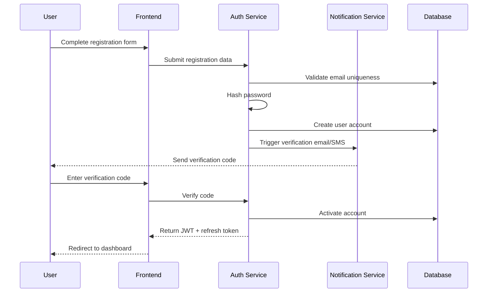
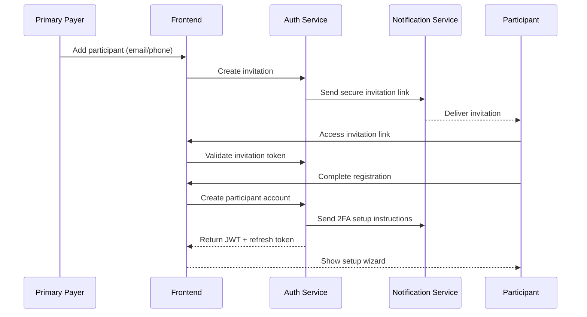
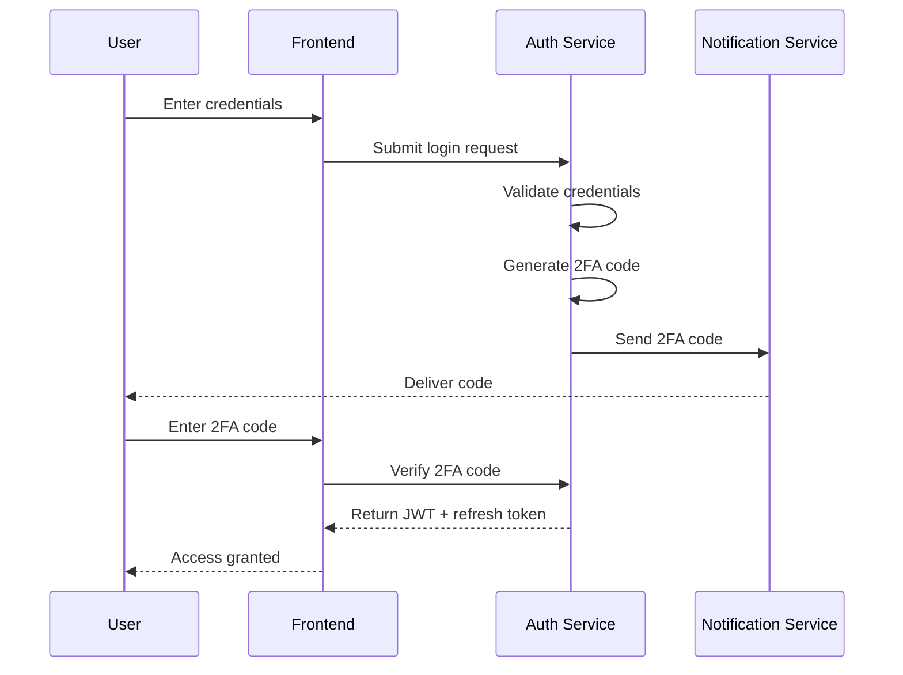
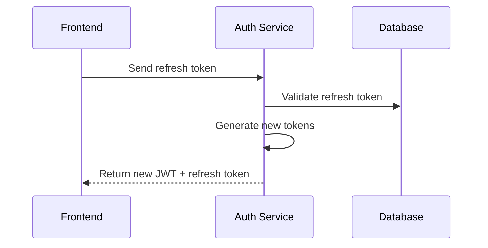
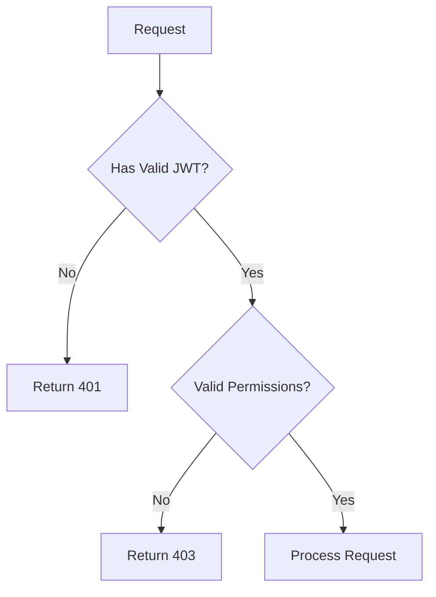
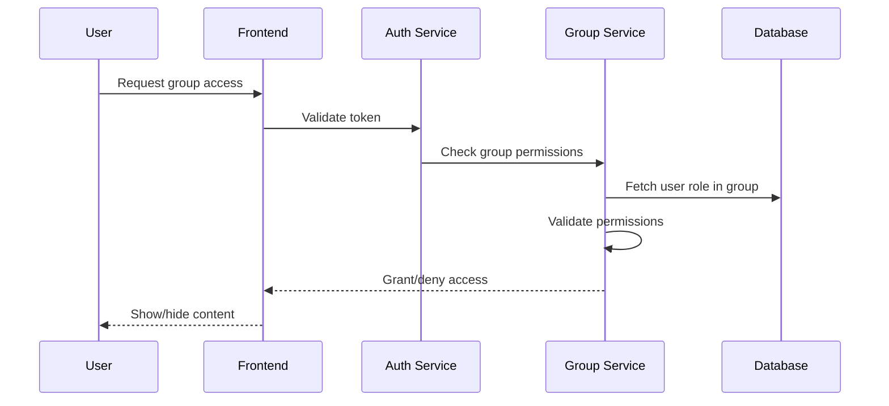

# Authentication and Authorization Flows

## Overview
This document outlines the authentication and authorization flows for the Shared Payment System, implementing secure, multi-factor authentication with role-based access control.

## Authentication Flows

### 1. Primary Payer Registration Flow



### 2. Participant Onboarding Flow



### 3. Login Flow with 2FA



### 4. Token Refresh Flow



## Authorization Flows

### 1. Role-Based Access Control



### 2. Group Access Control



## Security Measures

### Password Requirements
- Minimum 10 characters
- Must include uppercase, lowercase, numbers, and special characters
- Password history prevention (last 5 passwords)
- Bcrypt hashing with salt

### Token Management
- JWT expiration: 15 minutes
- Refresh token expiration: 7 days
- Secure httpOnly cookies
- Token rotation on refresh

### 2FA Implementation
- Time-based one-time passwords (TOTP)
- SMS/Email backup codes
- Remember device option (30 days)
- Rate limiting for verification attempts

### Session Management
- Device tracking
- Concurrent session limits
- Force logout capability
- Session activity logging

## Error Handling

### Authentication Errors
- Invalid credentials
- Expired tokens
- Invalid 2FA codes
- Account lockout
- Rate limit exceeded

### Authorization Errors
- Insufficient permissions
- Invalid role
- Group access denied
- Resource not found
- Operation not allowed

## API Security Headers

```yaml
Security Headers:
  - X-Content-Type-Options: nosniff
  - X-Frame-Options: DENY
  - X-XSS-Protection: 1; mode=block
  - Strict-Transport-Security: max-age=31536000; includeSubDomains
  - Content-Security-Policy: default-src 'self'
  - Referrer-Policy: strict-origin-when-cross-origin
```

## Compliance Measures

### Data Protection
- Personal data encryption
- Audit logging
- Data access controls
- Right to be forgotten implementation

### Security Monitoring
- Failed login attempts tracking
- Suspicious activity detection
- Real-time security alerts
- Regular security audits

### Access Logs
- Login attempts
- Permission changes
- Token refreshes
- Critical operations