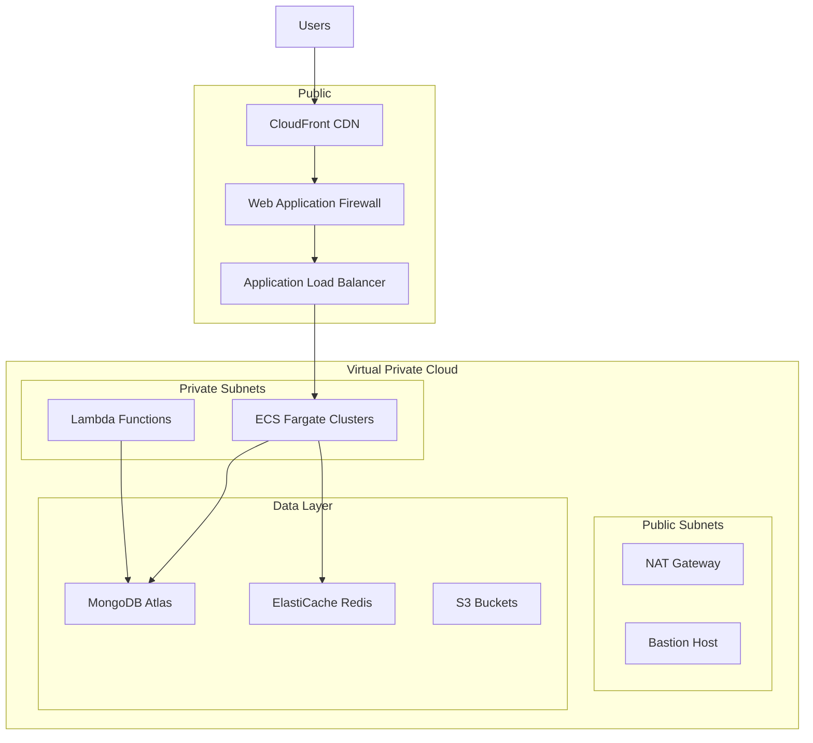

# Deployment and Scalability Strategy

## Infrastructure Architecture

### AWS Infrastructure


## Deployment Strategy

### Environment Setup
```yaml
Environments:
  Development:
    Domain: dev.sharedpayments.com
    Auto Scaling: min 1, max 2
    Features: All features enabled
    
  Staging:
    Domain: staging.sharedpayments.com
    Auto Scaling: min 2, max 4
    Features: Production configuration
    
  Production:
    Domain: sharedpayments.com
    Auto Scaling: min 3, max 10
    Features: Stable features only
```

### CI/CD Pipeline
```yaml
Pipeline Stages:
  Build:
    - Code checkout
    - Dependencies installation
    - Static code analysis
    - Unit tests
    - Build artifacts

  Test:
    - Integration tests
    - Security scans
    - Performance tests
    - Code coverage

  Deploy:
    - Infrastructure updates
    - Blue/Green deployment
    - Health checks
    - Smoke tests

  Post-Deploy:
    - Monitoring checks
    - Performance validation
    - Security validation
```

## Scalability Strategy

### Application Scaling
```yaml
Horizontal Scaling:
  Frontend:
    - Auto-scaling based on CPU/Memory
    - CDN for static content
    - Edge caching

  Backend:
    - Container orchestration with ECS
    - Auto-scaling policies
    - Load balancer distribution

Database Scaling:
  MongoDB:
    - Replica sets for redundancy
    - Horizontal scaling with sharding
    - Read replicas for queries

  Redis:
    - Cluster mode enabled
    - Read replicas
    - Cache optimization
```

### Performance Optimization
```yaml
Caching Strategy:
  Browser:
    - Service worker caching
    - Local storage
    - Memory cache

  CDN:
    - Static assets
    - API responses
    - Edge computing

  Application:
    - Redis caching
    - Response caching
    - Query caching
```

## High Availability

### Redundancy
```yaml
Multi-AZ Deployment:
  - Load balancers
  - Application instances
  - Database clusters
  - Cache clusters

Failover:
  - Automated failover
  - Cross-region backup
  - Data replication
  - Health monitoring
```

### Disaster Recovery
```yaml
Backup Strategy:
  Database:
    - Continuous backup
    - Point-in-time recovery
    - Cross-region replication

  Files:
    - S3 versioning
    - Cross-region replication
    - Lifecycle policies

Recovery Plans:
  - RPO: 1 hour
  - RTO: 4 hours
  - Regular DR testing
  - Automated recovery
```

## Monitoring and Alerts

### Infrastructure Monitoring
```yaml
Metrics:
  - CPU utilization
  - Memory usage
  - Network throughput
  - Disk I/O
  - Queue length

Alerts:
  - Resource thresholds
  - Error rates
  - Response times
  - Security events
```

### Application Monitoring
```yaml
Performance:
  - API response times
  - Database queries
  - Cache hit rates
  - Error rates

Business Metrics:
  - User activity
  - Transaction volume
  - Payment success rates
  - Feature usage
```

## Cost Optimization

### Resource Management
```yaml
Strategies:
  - Reserved instances
  - Spot instances
  - Auto-scaling policies
  - Resource cleanup

Monitoring:
  - Cost allocation tags
  - Budget alerts
  - Usage analysis
  - Optimization recommendations
```

## Security Measures

### Infrastructure Security
```yaml
Network:
  - VPC segmentation
  - Security groups
  - NACLs
  - VPN access

Access Control:
  - IAM roles
  - Least privilege
  - MFA
  - Audit logging
```

## Deployment Procedures

### Release Process
```yaml
Steps:
  1. Release branch creation
  2. Version bump
  3. Changelog update
  4. Security review
  5. Staging deployment
  6. UAT testing
  7. Production deployment
  8. Post-deployment verification

Rollback:
  - Automated rollback triggers
  - Manual rollback process
  - Data integrity checks
  - Communication plan
```

### Configuration Management
```yaml
Strategy:
  - Environment variables
  - AWS Parameter Store
  - Secrets Manager
  - Feature flags

Management:
  - Version control
  - Change tracking
  - Access control
  - Audit logging
```

## Maintenance

### Routine Maintenance
```yaml
Tasks:
  - Security patches
  - Dependency updates
  - Performance optimization
  - Resource cleanup

Schedule:
  - Daily automated tasks
  - Weekly maintenance window
  - Monthly security updates
  - Quarterly review
```

### Incident Management
```yaml
Process:
  - Detection
  - Classification
  - Response
  - Resolution
  - Post-mortem
  - Improvement plan

Communication:
  - Status page
  - Incident updates
  - Stakeholder communication
  - Resolution notification