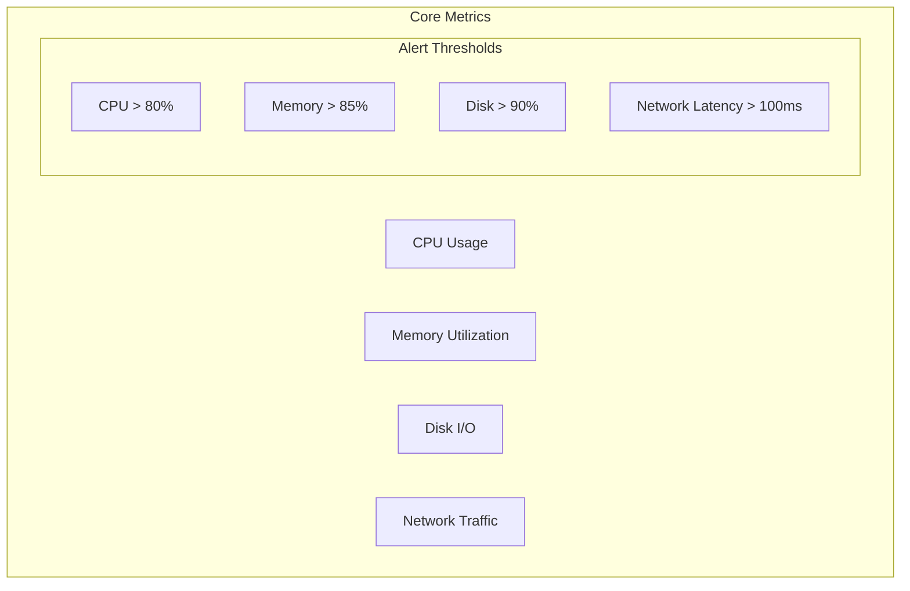

# Monitoring and Analytics Strategy

## Overview
This document outlines the comprehensive monitoring and analytics strategy for the Shared Payment System, ensuring optimal performance, reliability, and business insights.

## Infrastructure Monitoring

### System Metrics


### Monitoring Stack
```yaml
Infrastructure Monitoring:
  Primary Tools:
    - AWS CloudWatch: System metrics and logs
    - Grafana: Visualization and dashboards
    - Prometheus: Metrics collection
    - ELK Stack: Log aggregation and analysis
    
  Key Metrics:
    System Level:
      - CPU utilization
      - Memory usage
      - Disk I/O
      - Network throughput
      - Connection pools
      
    Container Level:
      - Container health
      - Resource usage
      - Restart counts
      - Log aggregation
      
    Database Level:
      - Query performance
      - Connection pools
      - Replication lag
      - Index effectiveness
```

## Application Performance Monitoring (APM)

### Frontend Monitoring
```yaml
Tools:
  - New Relic Browser
  - Google Analytics 4
  - Custom error tracking

Metrics:
  Performance:
    - First Contentful Paint (FCP)
    - Largest Contentful Paint (LCP)
    - First Input Delay (FID)
    - Cumulative Layout Shift (CLS)
    - Time to Interactive (TTI)
    
  User Experience:
    - Page load time
    - Session duration
    - Bounce rate
    - Error rate
    - User flows
```

### Backend Monitoring
```yaml
Tools:
  - New Relic APM
  - AWS X-Ray
  - Custom middleware

Metrics:
  API Performance:
    - Response times
    - Error rates
    - Request throughput
    - Cache hit rates
    
  Critical Paths:
    - Payment processing
    - Authentication flows
    - Meter reading submission
    - Group operations
```

## Business Analytics

### Key Performance Indicators (KPIs)
```yaml
User Metrics:
  Growth:
    - Daily Active Users (DAU)
    - Monthly Active Users (MAU)
    - User registration rate
    - User retention rate
    
  Engagement:
    - Session duration
    - Feature adoption rate
    - Group participation rate
    - Meter reading compliance

Financial Metrics:
  Transactions:
    - Total transaction volume
    - Average transaction value
    - Payment success rate
    - Processing fee revenue
    
  Business Health:
    - Monthly Recurring Revenue (MRR)
    - Customer Acquisition Cost (CAC)
    - Customer Lifetime Value (CLV)
    - Churn rate
```

## Real-time Monitoring and Alerting

### Alert Priority Levels
```yaml
P0 (Critical):
  Response Time: < 15 minutes
  Examples:
    - System outage
    - Payment processing failure
    - Security breach
    - Data loss

P1 (High):
  Response Time: < 1 hour
  Examples:
    - Performance degradation
    - High error rates
    - Authentication issues
    - Integration failures

P2 (Medium):
  Response Time: < 4 hours
  Examples:
    - Non-critical feature issues
    - Minor performance issues
    - Isolated errors
    - Warning thresholds

P3 (Low):
  Response Time: Next business day
  Examples:
    - UI/UX improvements
    - Non-urgent bugs
    - Feature requests
    - Documentation updates
```

## Analytics Implementation

### Data Collection
```yaml
Event Tracking:
  User Actions:
    - Page views
    - Feature usage
    - Error encounters
    - Payment actions
    
  System Events:
    - Performance metrics
    - Error logs
    - Security events
    - Integration status

Data Processing:
  - Real-time processing
  - Batch processing
  - Data warehousing
  - Analytics pipelines
```

### Visualization and Reporting
```yaml
Dashboards:
  Executive Dashboard:
    - Business KPIs
    - Growth metrics
    - Financial overview
    - System health
    
  Operational Dashboard:
    - Real-time metrics
    - System performance
    - Error tracking
    - User activity
    
  Technical Dashboard:
    - Infrastructure metrics
    - Application performance
    - Security events
    - API metrics
```

## Machine Learning and Analytics

### Anomaly Detection
```yaml
Detection Areas:
  User Behavior:
    - Unusual login patterns
    - Suspicious transactions
    - Abnormal usage patterns
    
  System Performance:
    - Resource usage spikes
    - Error rate anomalies
    - Performance degradation
    - Network anomalies
```

### Predictive Analytics
```yaml
Use Cases:
  Resource Planning:
    - Capacity forecasting
    - Load prediction
    - Storage requirements
    
  Business Intelligence:
    - User growth prediction
    - Revenue forecasting
    - Churn prediction
    - Feature adoption
```

## Implementation Plan

### Phase 1: Core Monitoring
```yaml
Duration: 2 weeks
Setup:
  - Infrastructure monitoring
  - Basic alerting
  - Log aggregation
  - Performance monitoring
```

### Phase 2: Advanced Analytics
```yaml
Duration: 3 weeks
Implementation:
  - Business analytics
  - Custom dashboards
  - Advanced alerting
  - Anomaly detection
```

### Phase 3: ML and Optimization
```yaml
Duration: 4 weeks
Tasks:
  - ML model implementation
  - Predictive analytics
  - Dashboard optimization
  - Alert fine-tuning
```

## Compliance and Security Monitoring

### Security Monitoring
```yaml
Focus Areas:
  - Authentication attempts
  - Authorization failures
  - Data access patterns
  - Security events
  - Compliance violations

Alerts:
  - Suspicious activities
  - Policy violations
  - Data breaches
  - Compliance issues
```

### Data Retention
```yaml
Policies:
  Metrics:
    - Real-time: 7 days
    - Aggregated: 90 days
    - Historical: 1 year
    
  Logs:
    - Application: 30 days
    - Security: 1 year
    - Audit: 7 years